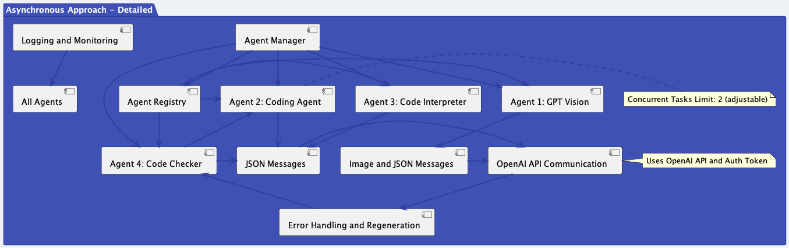

# # Autorust - AI Agent Communication implementation in Rust - MVP Purposes

## Introduction

This is an MVP for a proposed Rust implementation of the [AI Agent Communication](https://github.com/microsoft/autogen) known as AutoGen developed by Microsoft.

The architecture of the system is shown below:



---

## Overview

Autorust is a Rust-based platform designed to process and execute code in a secure and efficient manner. It utilizes a microservice architecture with different agents handling specific tasks, including image analysis, code generation, execution, and validation. The system integrates with Google Cloud Functions for secure and isolated code execution.

## Features

- **GPT Vision Agent**: Analyzes images and generates specifications using an external image analysis API.
- **Coding Agent**: Translates specifications into executable code.
- **Code Interpreter Agent**: Sends code to Google Cloud Functions for execution in a secure, sandboxed environment.
- **Code Checker Agent**: Validates the execution results and provides feedback.

## Installation and Setup

To set up and run Autorust, follow these steps:

1. **Clone the Repository**:
   ```bash
   git clone https://github.com/your-repository/autorust.git
   cd autorust
   ```

2. **Install Dependencies**:
   Make sure you have Rust and Cargo installed. Then run:
   ```bash
   cargo build
   ```

3. **Configure Google Cloud Functions**:
  - Set up a Google Cloud Function for code execution.
  - Configure the function URL in the Code Interpreter Agent.

4. **Environment Variables**:
  - Set necessary environment variables, such as API keys for image analysis and Google Cloud credentials.

5. **Run the Application**:
   ```bash
   cargo run
   ```

## Usage

- The system can be interacted with through API calls or direct function invocations within the Rust code.
- Messages are processed by different agents depending on their type and content.

## Security

- All code execution is handled in a sandboxed environment using Google Cloud Functions.
- Input validation and sanitization are performed to prevent common security vulnerabilities.

## Testing

- Unit tests can be run using Cargo:
  ```bash
  cargo test
  ```


---

### Additional Notes
- Agent-based parallelism: optimise the threading across agents based on which agent is doing more work at any given time
- Adversarial collaboration:
  - one agent creates specs,
  - another builds code
  - another runs it
  - the final one propagates feedback to the second agent for further iteration

### PUML Diagrams:

#### Asynchronous Approach - detailed
```PUML
@startuml
skinparam backgroundColor #EEF2F7
skinparam shadowing false
skinparam ArrowColor #555555
skinparam ArrowFontColor #555555
skinparam ArrowFontSize 10
skinparam ArrowFontStyle bold
skinparam ActorBorderColor #303F9F
skinparam ActorBackgroundColor #3F51B5
skinparam ActorFontSize 10
skinparam ActorFontColor #FFFFFF
skinparam classBorderColor #303F9F
skinparam classBackgroundColor #3F51B5
skinparam classArrowColor #303F9F
skinparam ClassFontSize 12
skinparam ClassFontColor #FFFFFF
skinparam ClassFontStyle bold
skinparam packageBorderColor #303F9F
skinparam packageBackgroundColor #3F51B5
skinparam packageFontColor #FFFFFF
skinparam packageFontSize 14

package "Asynchronous Approach - Detailed" {
    [Agent Manager] -down-> [Agent Registry]
    [Agent Manager] -right-> [Agent 1: GPT Vision]
    [Agent Manager] -down-> [Agent 2: Coding Agent]
    [Agent Manager] -down-> [Agent 3: Code Interpreter]
    [Agent Manager] -down-> [Agent 4: Code Checker]

    [Agent Registry] -right-> [Agent 1: GPT Vision]
    [Agent Registry] -right-> [Agent 2: Coding Agent]
    [Agent Registry] -right-> [Agent 3: Code Interpreter]
    [Agent Registry] -right-> [Agent 4: Code Checker]

    [Agent 1: GPT Vision] -right-> [Image and JSON Messages]
    [Agent 2: Coding Agent] -right-> [JSON Messages]
    [Agent 3: Code Interpreter] -right-> [JSON Messages]
    [Agent 4: Code Checker] -right-> [JSON Messages]

    [JSON Messages] -right-> [OpenAI API Communication]
    [Image and JSON Messages] -right-> [OpenAI API Communication]

    [OpenAI API Communication] -down-> [Error Handling and Regeneration]
    [Error Handling and Regeneration] -left-> [Agent 4: Code Checker]
    [Agent 4: Code Checker] -up-> [Agent 2: Coding Agent]

    [Logging and Monitoring] -down-> [All Agents]

    note right of [OpenAI API Communication]
        Uses OpenAI API and Auth Token
    end note

    note right of [Agent 2: Coding Agent]
        Concurrent Tasks Limit: 2 (adjustable)
    end note
}
@enduml
```
#### Async Approach - High Level/simplified
```PUML
@startuml
skinparam backgroundColor #EEF2F7
skinparam shadowing false
skinparam ArrowColor #555555
skinparam ArrowFontColor #555555
skinparam ArrowFontSize 10
skinparam ArrowFontStyle bold
skinparam ActorBorderColor #303F9F
skinparam ActorBackgroundColor #3F51B5
skinparam ActorFontSize 10
skinparam ActorFontColor #FFFFFF
skinparam classBorderColor #303F9F
skinparam classBackgroundColor #3F51B5
skinparam classArrowColor #303F9F
skinparam ClassFontSize 12
skinparam ClassFontColor #FFFFFF
skinparam ClassFontStyle bold
skinparam packageBorderColor #303F9F
skinparam packageBackgroundColor #3F51B5
skinparam packageFontColor #FFFFFF
skinparam packageFontSize 14

package "Asynchronous Approach" {
    [Agent Manager] -down-> [Individual Agents]
    [Individual Agents] -right-> [Incoming Message Queue]
    [Incoming Message Queue] -down-> [Message Processing]
    [Message Processing] -left-> [Inter-Agent Communication]
    [Inter-Agent Communication] -up-> [Agent Manager]
}
@enduml
```

#### Synchronous Approach - considered but not implemented
```PUML
@startuml
skinparam backgroundColor #EEF2F7
skinparam shadowing false
skinparam ArrowColor #555555
skinparam ArrowFontColor #555555
skinparam ArrowFontSize 10
skinparam ArrowFontStyle bold
skinparam ActorBorderColor #303F9F
skinparam ActorBackgroundColor #3F51B5
skinparam ActorFontSize 10
skinparam ActorFontColor #FFFFFF
skinparam classBorderColor #303F9F
skinparam classBackgroundColor #3F51B5
skinparam classArrowColor #303F9F
skinparam ClassFontSize 12
skinparam ClassFontColor #FFFFFF
skinparam ClassFontStyle bold
skinparam packageBorderColor #303F9F
skinparam packageBackgroundColor #3F51B5
skinparam packageFontColor #FFFFFF
skinparam packageFontSize 14

package "Synchronous Approach" {
    [Main Loop] -down-> [Agent List]
    [Main Loop] -down-> [Initial Prompt]
    [Initial Prompt] -right-> [API Call]
    [API Call] -down-> [Message Queue]
    [Message Queue] -left-> [Agent Execution]
    [Agent Execution] -up-> [Main Loop]
}
@enduml
```
